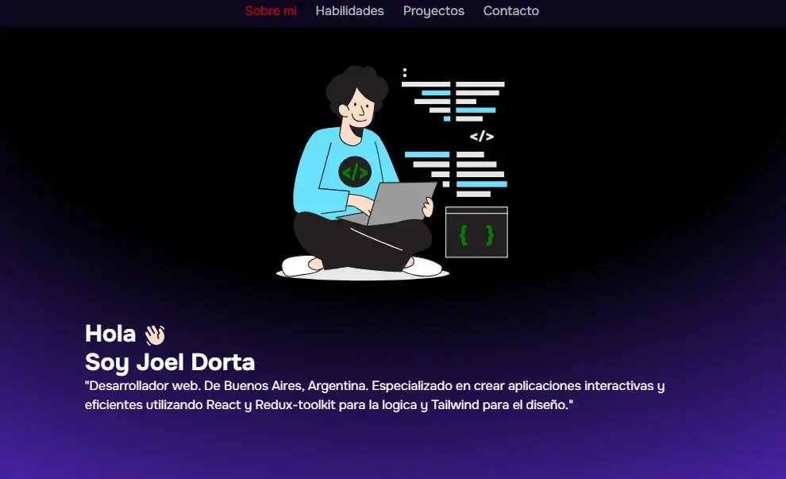
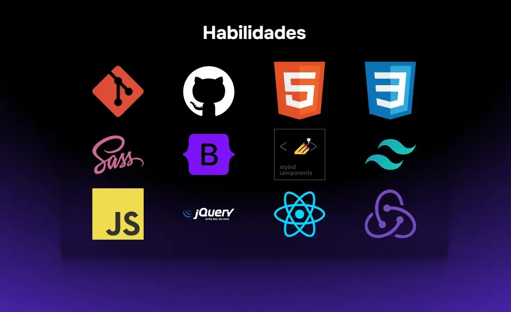
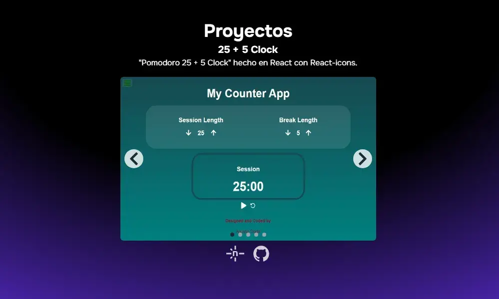
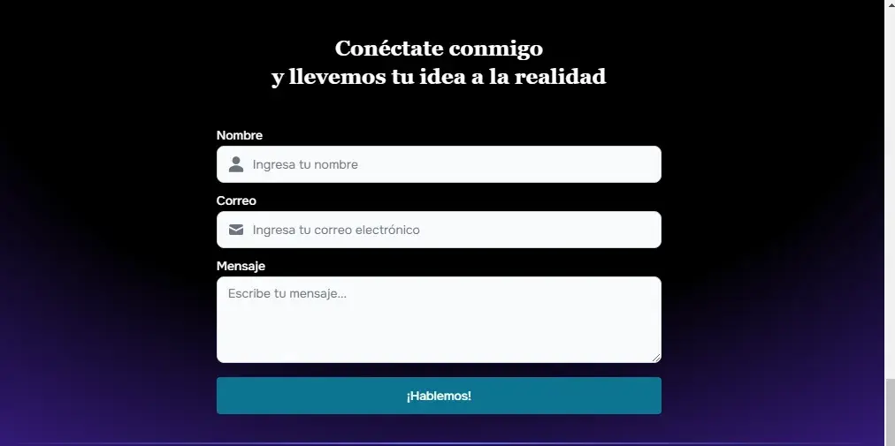

# Front-End Developer Portfolio

Welcome to my personal portfolio website! This project showcases my skills, projects, and experience as a Front-End Developer.

---

## Table of Contents
- [🌟 Features](#🌟-Features)
- [🚀 Technologies Used](#🚀-Technologies-Used)
- [📂 File Structure](#📂-File-Structure)
- [🌐 Live Demo](#🌐-Live-Demo)
- [📸 Screenshots](#📸-Screenshots)
- [📬 Contact Me](#📬-Contact-Me)
- [🛠️ How to Run the Project Locally](#🛠️-How-to-Run-the-Project-Locally)
- [Project status](#Project-status)

## 🌟 Features

- **Modern UI Design**: Clean and responsive design built with Tailwind CSS.
- **React Integration**: Dynamic components powered by React.js.
- **Interactive Contact Form**: Submit messages directly to my email using EmailJS.
- **Project Gallery**: View detailed descriptions and live links to my featured projects.
- **Responsive Design**: Optimized for both desktop and mobile devices.

---

## 🚀 Technologies Used

- **React.js**: For building reusable and dynamic UI components.
- **Tailwind CSS**: For styling and a seamless, modern design.
- **EmailJS**: For handling the contact form functionality.
- **React-Hook-Form**: For managing form validation and state.
- **Flowbite React**: For pre-designed UI components.
- **React-Icons**: For including scalable vector icons.
- **JavaScript (ES6)**: For logic and interactivity.
- **HTML5 & CSS3**: For structure and styling.

---

## 📂 File Structure

```
Portfolio/
├── public/
├── src/
│   ├── App.jsx
│   ├── index.css
│   ├── main.jsx
│   ├── listado.txt
│   ├── assets/
│   │   ├── icons/
│   │   │   ├── bootstrap.svg
│   │   │   ├── css3.svg
│   │   │   ├── flowbiteReact.svg
│   │   │   ├── git.svg
│   │   │   ├── github.svg
│   │   │   ├── HTML5.svg
│   │   │   ├── javascript.svg
│   │   │   ├── jQuery.svg
│   │   │   ├── linkedin.svg
│   │   │   ├── react.svg
│   │   │   ├── reactIcon.svg
│   │   │   ├── redux.svg
│   │   │   ├── sass.svg
│   │   │   ├── styledComponents.svg
│   │   │   ├── tailwind.svg
│   │   ├── me.webp
│   │   ├── webdeveloperflatline.svg
│   │   ├── proyectos/
│   │       ├── calculator.webp
│   │       ├── drumsMachine.webp
│   │       ├── markdownPreviewer.webp
│   │       ├── pomodoro.webp
│   │       ├── randomQuoteMachine.webp
│   ├── components/
│   │   ├── aboutMe/
│   │   │   └── AboutMe.jsx
│   │   ├── contact/
│   │   │   ├── contact.jsx
│   │   │   ├── Form.jsx
│   │   │   └── Inputs.jsx
│   │   ├── footer/
│   │   │   └── Footer.jsx
│   │   ├── header/
│   │   │   └── Header.jsx
│   │   ├── nav.jsx
│   │   ├── projects/
│   │   │   └── Projects.jsx
│   │   ├── skills/
│   │       ├── skill.js
│   │       └── Skills.jsx
│   ├── data/
│   │   ├── portfolioProjects.js
│   │   └── skills.js
│   ├── store/
│       └── Store.jsx
├── package.json
└── README.md
```

---


## 🌐 Live Demo

Check out the live version of my portfolio [here](https://your-portfolio-link.com).

---

## 📸 Screenshots

### Projects Section





---

## 📬 Contact Me

Feel free to reach out via the contact form on the website or through:

- **Email**: [yoelagustindorta@gmail.com](mailto:yoelagustindorta@gmail.com)
- **LinkedIn**: [Your LinkedIn Profile](www.linkedin.com/in/joel-agustín-dorta-49b153216)
- **GitHub**: [Your GitHub](https://github.com/mordok22012)

---

## 🛠️ How to Run the Project Locally

1. Clone the repository:

   ```bash
   git clone https://github.com/mordok22012/portfolio.git
   ```

2. Navigate to the project directory:

   ```bash
   cd portfolio
   ```

3. Install dependencies:

   ```bash
   npm install
   ```

4. Start the development server:

   ```bash
   npm run dev
   ```

5. Open your browser and go to `http://localhost:5173`.

---


## Project status
This project is finished.

